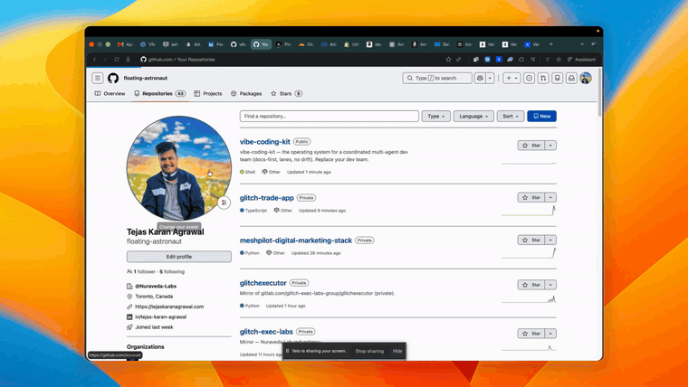
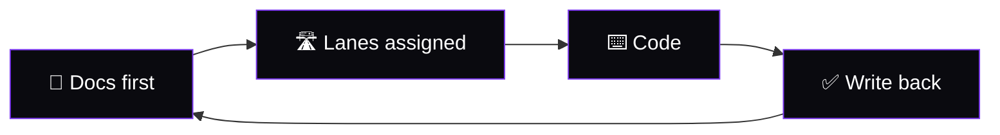
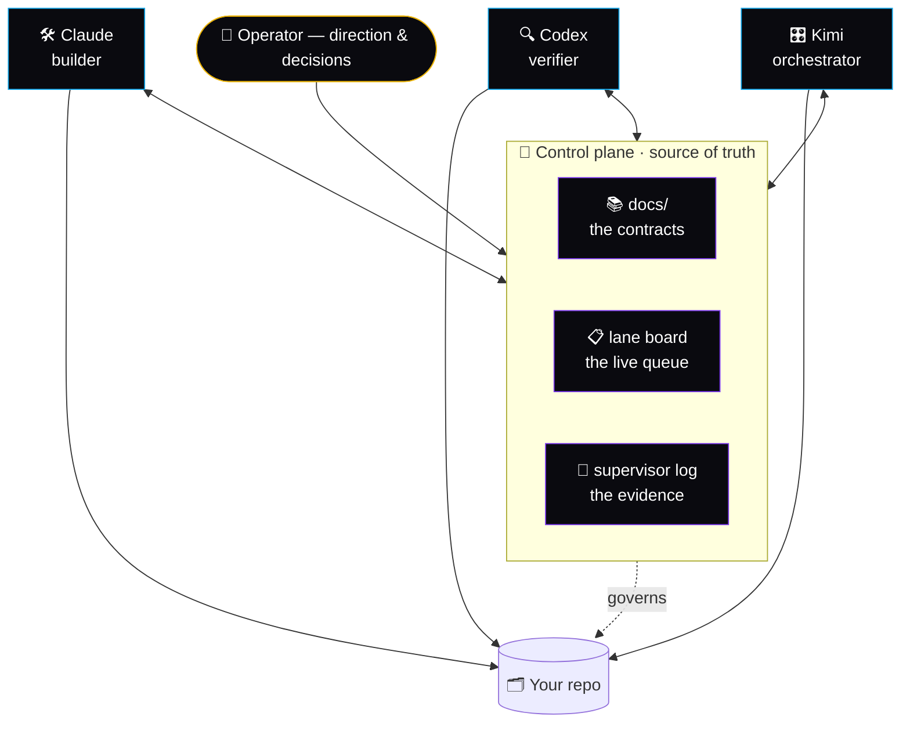
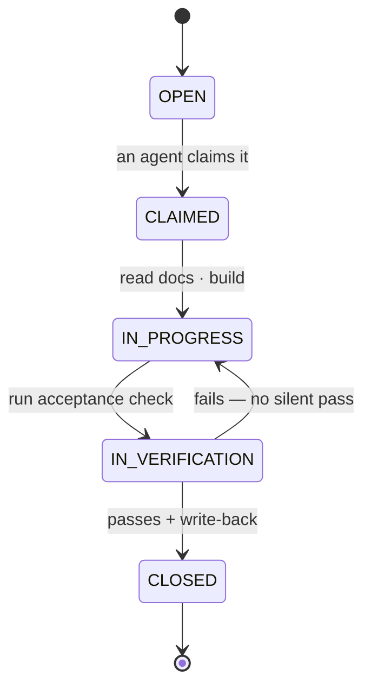

<h1 align="center">Vibe Coding Kit</h1>

<p align="center"><b>Replace your dev team — you don't need one anymore.</b></p>

<p align="center">
  
  
  
  
</p>

<p align="center">
  <a href="https://youtu.be/7udCWIHOzCg"></a>
</p>

<p align="center"><sub>▶ <a href="https://youtu.be/7udCWIHOzCg"><b>Full walkthrough — HD, with audio</b></a></sub></p>

<p align="center">
  One operator + a coordinated <b><a href="https://github.com/anthropics/claude-code">Claude&nbsp;Code</a> · <a href="https://github.com/openai/codex">Codex</a> · <a href="https://github.com/MoonshotAI/Kimi-K2">Kimi</a></b> team ships like a squad.<br/>
  This is the operating system for that team: docs-first discipline, bounded lanes,
  and zero-drift handoffs across agents.
</p>

---

## The story

Everybody can get an AI agent to write code. Almost nobody can get *three* agents
to work the same codebase for weeks without contradicting each other, forgetting
last week's decisions, or quietly drifting away from the plan.

This kit is the answer to that problem — and it wasn't invented in the abstract.
It's the exact method one operator used to ship real production software with a
team made entirely of AI agents:



<p align="center"><sub>The cycle that produces zero drift — every loop leaves the docs truer than it found them.</sub></p>

The docs are the source of truth. Work is cut into bounded **lanes**. Each lane
has one owner, required reading, an acceptance check, and a write-back duty. A
lightweight **control plane** (a live lane board + an append-only evidence log)
keeps every agent — and your future self — aligned. No human babysitting context.

## How it works

The **control plane** is the single source of truth. Every agent reads it before
touching code and writes back to it before closing a lane. The operator sets
direction; the agents work by comparative advantage; nobody collides.



### A lane, start to close



## Proven in production

This isn't a toy. The same method shipped these, with no traditional dev team:

| Product | What it is | Built with this method |
|---|---|---|
| **[Mesh Pilot](https://meshpilot.app)** | An open agent mesh + proprietary orchestration brain | ✅ |
| **[Glitch Executor](https://glitchexecutor.com)** | A prop-firm trading dashboard — challenge tracking, strategy builder, rule-aware backtester | ✅ |
| **This kit** | Vibe Coding Kit itself | ✅ — see below |

And the strongest proof: **this repo was built by its own method.** The
`control-plane/` directory is real — open `ACTIVE_LANE_BOARD.md` and
`ENGINEERING_SUPERVISOR.md` and you'll see every lane of this build (L0–L6),
who owned it, and the evidence it was verified. Claude built the method and
tooling; Kimi ran the refresh and the proof lane. Two agents, one repo, zero
collisions.

## Fast start

```bash
git clone <this-repo> && cd vibe-coding-kit
./bin/vibe-scaffold /path/to/your-project   # drop the method into any repo
```

Then open `INSTALL-PROMPT.md`, paste it into your agent, and read
`docs/THE-METHOD.md` — the loop that prevents drift.

## The three tools

### `bin/vibe-scaffold [target-dir]`
Drops the full method into any repo: the method docs, a fresh control plane
(lane board, session coordination, supervisor log), and per-agent enforcing
configs. Run once per project to make it multi-agent safe.

### `bin/vibe-lane`
Manage lanes on the live board from the CLI.
```bash
vibe-lane open  L1 "wire up auth"
vibe-lane claim L1 Claude
vibe-lane state L1 "IN VERIFICATION"
vibe-lane close L1 "auth flow end-to-end passing"
```

### `bin/vibe-writeback`
Automate the write-back that closes a lane.
```bash
vibe-writeback supervisor L1   # prefill an evidence entry from git
vibe-writeback changelog       # regenerate CHANGELOG.md from git log
```

## Agent roles

| Agent | Default role | When to assign |
|---|---|---|
| **[Claude Code](https://github.com/anthropics/claude-code)** | Builder | Heavy multi-file authoring, refactors, migrations |
| **[Codex](https://github.com/openai/codex)** | Verifier & finisher | Rendered-page verification, detail polish, bug-finding |
| **[Kimi](https://github.com/MoonshotAI/Kimi-K2)** | Orchestrator | Cross-repo work, parallel verification, infra checks |
| **[Cursor](https://cursor.com)** | Builder | IDE-based deep coding with AI assist |
| **[Aider](https://github.com/Aider-AI/aider)** | Builder | Terminal-first precise edits with git discipline |

Keep the three *functions* covered — **builder / verifier / orchestrator** — and
map your roster onto them. The method depends on the functions, not the tools.

## What you get

- `docs/THE-METHOD.md` — the core loop, and why it kills drift.
- `docs/AGENT-SYNC-PROTOCOL.md` — the multi-agent contract every session agrees to.
- `docs/ROLES.md` · `docs/LANE-LIFECYCLE.md` · `docs/DOC-SYSTEM.md` — the rest of the method.
- `control-plane/` — lane board, session coordination, supervisor log (templates + this build's live set).
- `agent-configs/` — enforcing configs for Claude Code, Codex, Kimi, Cursor, Aider.
- `bin/` — `vibe-scaffold`, `vibe-lane`, `vibe-writeback`.

## Proof — a real lane, start to close

This kit was built with its own method. A real zero-drift lane on a freshly
scaffolded repo:

```bash
$ vibe-scaffold /tmp/vibe-proof              # 11 files placed
$ cd /tmp/vibe-proof
$ vibe-lane open  PROOF-1 "zero-drift demo"  # opened PROOF-1
$ vibe-lane claim PROOF-1 Kimi               # claimed PROOF-1 -> Kimi
$ vibe-lane state PROOF-1 "IN VERIFICATION"  # PROOF-1 -> [IN VERIFICATION]
$ vibe-lane close PROOF-1 "verified end-to-end"
$ vibe-writeback supervisor PROOF-1 Kimi     # evidence appended
```

Result: the board shows PROOF-1 in **Recently closed** and the supervisor log
holds a dated evidence entry — board, repo, and evidence consistent, no human
in the loop.

## Built by a coordinated agent team

This kit was authored by AI agents working The Method, lane by lane. Full record
in `control-plane/ENGINEERING_SUPERVISOR.md`. See [`AUTHORS.md`](./AUTHORS.md).

| Lanes | Owner |
|---|---|
| L0–L4 — design, method docs, control plane, enforcing configs, tooling | **Claude** (builder) |
| L5–L6 — v1 refresh + positioning, proof run | **Kimi** (orchestrator) |
| Direction, review, decisions | **Tejas Karan Agrawal** (operator) |

## Security

- Never commit `.env` files.
- Never paste live keys into Git, chat, or Slack/Discord unless you're rotating them.
- Let your local agent write real secrets only into local ignored files, never into tracked config.
- Keep client data out of prompts unless the client approved that workflow.

## License

MIT. See [`LICENSE`](./LICENSE).

<sub>Built in the open by <a href="https://tejaskaranagrawal.com">Tejas Karan Agrawal</a> — with a team of agents.</sub>
