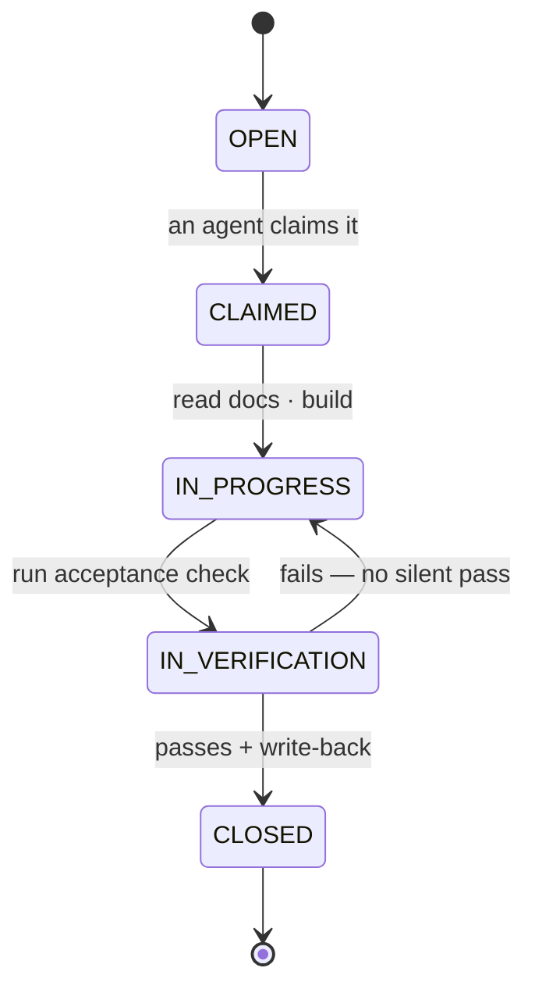

# Lane Lifecycle

A **lane** is the unit of work in the Method: the smallest end-to-end slice one
agent can own, verify, and close. This is the full lifecycle, from cut to closed.

## States



A lane lives on `control-plane/ACTIVE_LANE_BOARD.md` and moves through these
states. The board is the single live queue.

## 1. OPEN — cut the lane

Anyone (operator or agent) cuts a lane. A well-formed lane declares:

- **ID + title** — e.g. `AUTH-3 — password reset flow`
- **Owner** — assigned agent (or `unassigned`)
- **Required reading** — the docs to read before code
- **Acceptance** — verifiable definition of done
- **Write-back** — which docs get updated on close

If the lane touches a contract with no doc yet, the **first sub-step is writing
that doc** (docs-first). Don't open a code lane on an undocumented contract.

## 2. CLAIMED — an agent takes it

An agent claims the lane on the board (sets owner + timestamp) and, in a
multi-session setup, notes it in `SESSION_COORDINATION.md` so others see it's
taken. Claiming is what prevents two agents colliding on one surface.

## 3. IN PROGRESS — read, then build

Before editing code, the owner reads: the sync protocol, `DOC-SYSTEM.md`, the
lane's required-reading docs, and the live board. Then builds the smallest
working increment. Verify-as-you-go.

## 4. IN VERIFICATION — prove it

The owner runs the acceptance check — tests, a build, a rendered-page
inspection, a route probe — whatever the lane's acceptance specified. For
higher-stakes lanes, a *different* agent verifies (Codex as the second pair of
eyes). A claim is not "done" until it's been observed to be true.

If verification fails, the lane drops back to IN PROGRESS. No silent passes.

## 5. CLOSED — write back

A lane closes only when all three are true:

1. **Contract docs updated** — every doc the change affects.
2. **Board updated** — status → CLOSED, with a one-line result.
3. **Evidence appended** — to `ENGINEERING_SUPERVISOR.md`: what was read, what
   changed, what verification passed, what remains.

Then state the handoff (see `AGENT-SYNC-PROTOCOL.md` §4) and, if relevant, the
next lane.

## Anti-patterns

- **Code before doc** on a contract change → drift. Write the doc first.
- **"Done" without verification** → unproven claim. Observe it.
- **Closing without write-back** → the lane is still open; the memory didn't update.
- **Two owners on one lane** → collision. Re-cut into separate surfaces.
- **The board and reality disagree** → fix the board; it's the live truth.

## A lane in one glance

```
### AUTH-3 — password reset flow            [IN VERIFICATION]
Owner: Claude            Opened: 2026-06-02
Reading: docs/AUTH.md, docs/EMAIL.md
Acceptance: reset email sends; token expires in 1h; e2e test green
Write-back: docs/AUTH.md (token TTL), CHANGELOG
Notes: token TTL chosen 1h per AUTH.md §4; Codex to verify the email render
```
